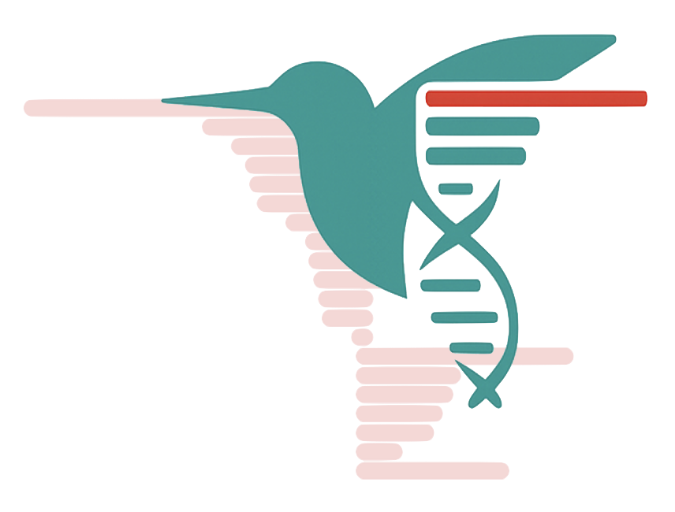

# kolibri

**Kernel-Operations for Long-read Insertion, Breakpoint & Recombination Inspection**

<p align="left">
  
</p>

`kolibri` is an R-based toolkit for inspecting long-read alignments (e.g. PacBio/ONT) to find, group, and visualize split reads that indicate structural variation, transposition, recombination, or other complex genome events. It grew out of analysis code for inspecting split PacBio CCS reads mapped to plant genomes.

> **Status:** Beta / research code. Interfaces may change.

---

## Created by

This package and example workflow were created by the **Monroe Lab, UC Davis** (Plant Sciences / Genome Center).

If you use code, ideas, or figures from this repository, **please cite the Monroe Lab / UC Davis** and link back to the repo. Even though this is beta, proper attribution helps us keep developing it.

Contact: **Grey Monroe** — <greymonroe@gmail.com>

---

## Installation (beta)

This is **not** on CRAN and **not** a complete R package yet. The current way to use it is:

1. **Clone or download** this GitHub repository:

```bash
git clone https://github.com/greymonroe/kolibri.git
```

or click **Download ZIP** on GitHub.

2. Open R/RStudio in the repo root and **source the main functions**:

```r
source("R/package_functions.R")
```

If you are missing dependencies (e.g. `data.table`, `ggplot2`, `ggraph`, `igraph`, maybe `Biostrings`), R will prompt / error. Install them with:

```r
install.packages(c("data.table", "ggplot2", "igraph", "ggraph"))
# if you need Biostrings:
# if (!requireNamespace("BiocManager", quietly = TRUE)) install.packages("BiocManager")
# BiocManager::install("Biostrings")
```

3. There is a vignette-style walkthrough:

```r
rmarkdown::render("kolibri_vignette.Rmd")
```

or open `kolibri_vignette.Rmd` in RStudio and knit it. It uses example files from the repo (e.g. BED12) so you can run the workflow end-to-end.

> **Note:** because this is beta, function names and arguments may change — check the vignette and `R/package_functions.R` for the current API.

---


`kolibri` is an R toolkit for working with split read alignments (mapped to a reference and exported as BED12). It helps you:

1. **Cluster** nearby alignment fragments per chromosome.
2. **Build** a shared-read **network** (nodes = clusters, edges = shared read names across clusters).
3. **Visualize** read mappings for a focal cluster and all clusters it connects to.
4. **Extract** the underlying genomic sequence for clusters from a reference FASTA.
5. **Probe** breakpoint density with reflection-aware KDE.

The goal is help “where else does this read map?” for diagnostics of genome assembly and discovering structural variation.

---

## Basic Workflow

Input is typically generated with something like

```sh
bedtools bamtobed -bed12 -i alignVA2.bam > alignVA2.bed12
```

```r
library(kolibri)
library(data.table)

# 1. read bed12
bed12 <- read_bed12("alignVA2.bed12")

# 2. filter to split, good-quality reads (example)
split_reads <- bed12[
  chrom %in% paste0("Chr", c(1,2,3,4,5,"M")) &
    nameN > 1 &
    score > 30 &
    aligned_length > 500
]

# 3. cluster per chromosome
clusters_sw <- cluster_reads_sweep(
  split_reads,
  chrom_col = "chrom",
  start     = "start",
  end       = "end",
  delta     = 1000,
  max_gap   = 2000,
  warn_if_clusters_closer_than = 5000,
  id_scope  = "per_chrom"
)

# 4. build network
net <- build_cluster_network(
  clusters_sw,
  cluster_col = "chrom_cluster_id",
  read_col    = "name",
  chrom_col   = "chrom",
  start_col   = "start",
  end_col     = "end",
  id_col      = "cluster_id",
  min_shared  = 1
)

# 5. plot network
p <- plot_cluster_network_ggraph(
  net,
  layout              = "fr",
  cap                 = 50,
  label               = TRUE,
  min_cluster_n       = 2,
  label_col           = "cluster",
  alpha_range         = c(1, 1),
  label_size          = 2,
  seed                = 10,
  keep_neighbors_of_kept = TRUE
)
p

# 6. plot reads for a specific node
plot_node_reads_by_cluster(
  net,
  node          = "Chr1_12953910",
  primary_color = "red",
  partner_color = "grey60",
  alpha_col     = "score"
)
```

---

## Functions

Below is an overview of the main functions that currently matter. Names/types may evolve.

### 1. `read_bed12(path)`
**Purpose:** read a (simplified) BED12 file and return a `data.table` suitable for clustering.

**Signature:**
```r
read_bed12(path)
```

**Notes:**
- Assumes **one block per line** (`blockCount == 1`).  
- Adds:  
  - `aligned_length` (end - start)  
  - `nameN` (number of occurrences of this read name in the file)

**Columns expected / created:**
- `chrom`, `start`, `end`, `name`, `score`, `strand`
- `thickStart`, `thickEnd`, `itemRgb`
- `blockCount`
- `aligned_length`
- `nameN`

---

### 2. `cluster_reads_sweep(...)`
**Purpose:** cluster intervals per chromosome using a sweep/greedy algorithm.

**Key args:**
- `dt`: `data.table` of BED(-like) rows
- `chrom_col`: chromosome column (default `"chrom"`)
- `start`, `end`: coordinate columns
- `delta`: max gap to **merge** consecutive intervals
- `max_gap`: hard cap on consecutive gap inside a cluster; if exceeded, the cluster is **split** and a note is issued
- `warn_if_clusters_closer_than`: report clusters that are too close (e.g. < 20 kb)
- `id_scope`: `"global"` or `"per_chrom"` for ID numbering

**Adds:**
- `cluster_id`
- `cluster_n`
- `chrom_cluster_id` (e.g. `Chr2_7354979` = chrom + cluster midpoint)
- split-notes are attached via messages

**What it does _not_ do:** it does **not** force a maximum cluster *span* in bp; it only checks the **distance between consecutive reads** inside a cluster.

---

### 3. `build_cluster_network(...)`
**Purpose:** turn clustered reads into a **network** of clusters connected by shared reads.

**How it works:**
1. take all `(cluster, read)` pairs
2. self-join on `read` to find all pairs of clusters that share that read
3. aggregate to edges: `shared_reads`, `shared_avg_score`, `shared_avg_len`
4. build node table
5. **filter reads** so only reads that are in **exactly 2** of the kept clusters are returned (this is what you wanted to stabilize network edges)

**Signature (simplified):**
```r
net <- build_cluster_network(
  dt,
  cluster_col = "chrom_cluster_id",
  read_col    = "name",
  chrom_col   = "chrom",
  start_col   = "start",
  end_col     = "end",
  id_col      = "cluster_id",
  include_noise = FALSE,
  restrict_within_chrom = FALSE,
  min_shared  = 1
)
```

**Returns:**
- `net$nodes`
  - `cluster` (label, e.g. `Chr1_12953910`)
  - `chrom`
  - `cluster_n` (**recomputed** after filtering to reads that appear in exactly 2 kept clusters)
  - `node_avg_score`
  - `node_avg_len`
  - `min_start`, `max_end`, `total_length`
  - `edge_count`
- `net$edges`
  - `cluster1`, `cluster2`
  - `shared_reads` (**recomputed** after filtering)
  - `shared_avg_score`, `shared_avg_len`
- `net$reads`
  - only rows from `dt` whose read name is found in **exactly 2** of the kept clusters

---

### 4. `plot_cluster_network_ggraph(...)`
**Purpose:** make a quick ggraph plot of the cluster network.

**Important args:**
- `net`: object from `build_cluster_network()`
- `layout`: `"fr"` (Fruchterman–Reingold), `"kk"`, `"lgl"`, `"drl"`, `"circle"`, etc.
- `cap`: cap node size at this many reads
- `alpha_var`: column in `net$nodes` to map to alpha, e.g. `"node_avg_score"`
- `min_cluster_n`: drop tiny nodes **unless** they are directly connected to a kept node (your rule)
- `keep_neighbors_of_kept = TRUE`: keep neighbors of retained nodes even if small
- `label`: whether to draw cluster labels
- `label_col`: which column to label nodes by

**Example:**
```r
p <- plot_cluster_network_ggraph(
  net,
  layout              = "fr",
  cap                 = 50,
  label               = TRUE,
  min_cluster_n       = 2,
  label_col           = "cluster",
  alpha_range         = c(1,1),
  label_size          = 2,
  seed                = 10,
  keep_neighbors_of_kept = TRUE
)
```

---

### 5. `plot_node_reads_by_cluster(...)`
**Purpose:** for **one** cluster (the "primary" node), plot all reads that belong to it **and** to any of the clusters it connects to in the network.

**Key ideas from your spec:**
- there must be **one y per read name**  
- y-order is driven **only** by the secondary clusters, not the primary
  1. rank secondary clusters by size (desc)
  2. within each secondary cluster, order reads by start
  3. assign y top→bottom from that global secondary order
- facets: **one facet per cluster** (primary first)
- primary segments in **red**, partner segments in **grey** (defaults)
- optional alpha by `score` or other column

**Signature (current):**
```r
plot_node_reads_by_cluster(
  net,
  node,
  cluster_col   = "chrom_cluster_id",
  read_id_col   = "name",
  start_col     = "start",
  end_col       = "end",
  alpha_col     = "score",
  alpha_range   = c(0.3, 1.0),
  primary_color = "red2",
  partner_color = "grey60",
  base_size     = 6
)
```


---

### 6. `plot_reads_around_node(...)`
**Purpose:** like the above, but you also look in the **original BED** for other reads that fall in a window around the node span (i.e. “what else aligns here that was *not* part of the multimapping cluster?”).

Useful for spotting extra local support, non-split reads, potential breakpoints.

---

### 7. `nodes_to_fasta(...)`
**Purpose:** export the genomic intervals corresponding to network nodes as FASTA.

**Signature (simplified):**
```r
nodes_to_fasta(
  net,
  genome,
  outfile = "clusters.fa",
  pad_bp  = 0,
  clusters = NULL,
  hard_fail_oob = TRUE
)
```

**Notes:**
- `genome` is a named list of `Biostrings::DNAString` or `seqinr`-style FASTA loaded object (e.g. `read.fasta`)
- coordinates are clamped to chromosome bounds **only** if `pad_bp > 0`
- if `pad_bp == 0` and we detect out-of-bounds intervals → **hard error**, as requested
- `clusters = NULL` means “all nodes in `net$nodes`”

---

### 8. KDE helpers (experimental)
We experimented with reflection-aware KDE to classify types of clusters based on edge-bias when breakpoints cluster at the edge of the window vs centered.

- `kde_reflect(x, bw = ..., ...)`
  - makes a reflected sample around min/max
  - runs `density()` on the expanded sample
  - returns the *real* x-grid part
- `plot_node_breaks_kde(net, node = ...)`
  - pulls `start` and `end` for reads in that node
  - fits KDE
  - overlays on histogram

These are useful for **looking** at breakpoint concentration; they are **not** a hard peak caller.

---

## Data Assumptions / Gotchas

- One row per **alignment fragment**. If you have true BED12 multi-block lines, read them and expand to 1-row-per-block first (or let `read_bed12()` warn you).
- Reads are identified by a **stable** `name` (PacBio CCS string etc).
- Clustering is done **per chromosome**.
- The network is built **after** filtering reads down to those present in **exactly 2** nodes (your rule to simplify the network).

---


## Notes / TODO

- see DBSCAN-based clustering  (`cluster_reads_dbscan()`)
- see KDE-based clustering (`cluster_reads_kde()`)

---

